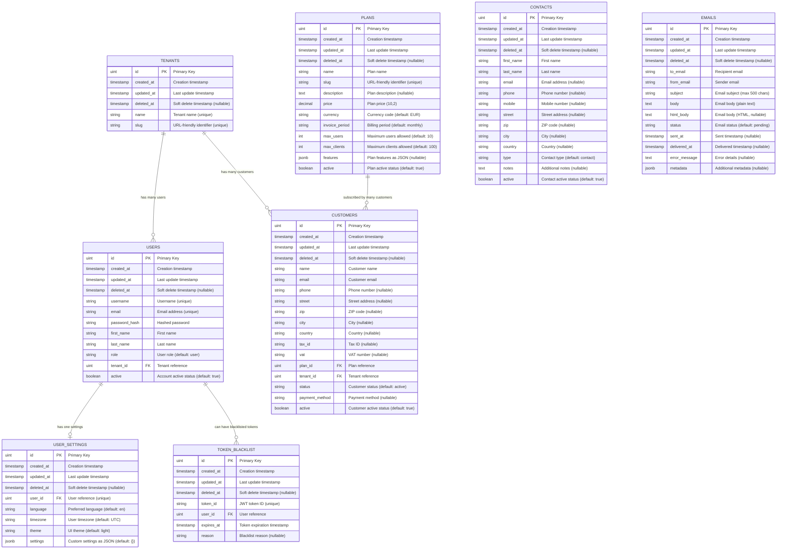

# AE SaaS Basic - Database Schema Documentation

## Entity-Relationship Diagram

This document describes the complete database schema for the AE SaaS Basic module, designed for multi-tenant SaaS applications.

### Database Overview

The AE SaaS Basic module implements a **multi-tenant architecture** with the following core entities:
- **Tenants** - Tenant separation
- **Users** - User accounts with role-based access
- **Plans** - Subscription plans and pricing
- **Customers** - Billing entities linked to tenants
- **Contacts** - Generic contact management
- **Emails** - Transactional email tracking
- **User Settings** - User preferences and configuration
- **Token Blacklist** - JWT security management

### Complete Entity-Relationship Diagram



### Database Design Principles

#### 1. Multi-Tenant Architecture
- **Tenants** serve as the primary tenant separator
- All tenant-specific data references `tenant_id`
- Data isolation enforced at application and database level

#### 2. Soft Deletes
- All tables implement soft deletes via `deleted_at` timestamp
- Enables data recovery and audit trails
- Indexes created on `deleted_at` for performance

#### 3. Timestamp Tracking
- Standard `created_at` and `updated_at` on all entities
- Database triggers automatically update `updated_at`
- Timezone-aware timestamps (TIMESTAMP WITH TIME ZONE)

#### 4. Flexible JSON Storage
- `plans.features` - Configurable plan features
- `emails.metadata` - Email tracking metadata
- `user_settings.settings` - Custom user preferences

### Table Relationships & Constraints

#### Foreign Key Relationships
```sql
-- User belongs to Tenant
FOREIGN KEY (tenant_id) REFERENCES tenants(id)

-- Customer belongs to Tenant and Plan
FOREIGN KEY (tenant_id) REFERENCES tenants(id)
FOREIGN KEY (plan_id) REFERENCES plans(id)

-- User Settings belongs to User (1:1)
FOREIGN KEY (user_id) REFERENCES users(id)

-- Token Blacklist belongs to User
FOREIGN KEY (user_id) REFERENCES users(id)
```

#### Unique Constraints
```sql
-- Tenants
UNIQUE (name)
UNIQUE (slug)

-- Plans
UNIQUE (slug)

-- Users
UNIQUE (username)
UNIQUE (email)

-- User Settings
UNIQUE (user_id) -- One settings record per user

-- Token Blacklist
UNIQUE (token_id) -- Prevent duplicate token entries
```

#### Database Indexes
```sql
-- Soft delete indexes (all tables)
CREATE INDEX idx_{table}_deleted_at ON {table}(deleted_at);

-- Tenant indexes
CREATE INDEX idx_tenants_slug ON tenants(slug);

-- User indexes
CREATE INDEX idx_users_username ON users(username);
CREATE INDEX idx_users_email ON users(email);
CREATE INDEX idx_users_tenant_id ON users(tenant_id);
CREATE INDEX idx_users_active ON users(active);

-- Customer indexes
CREATE INDEX idx_customers_email ON customers(email);
CREATE INDEX idx_customers_plan_id ON customers(plan_id);
CREATE INDEX idx_customers_tenant_id ON customers(tenant_id);
CREATE INDEX idx_customers_status ON customers(status);

-- Plan indexes
CREATE INDEX idx_plans_active ON plans(active);
CREATE INDEX idx_plans_slug ON plans(slug);

-- Contact indexes
CREATE INDEX idx_contacts_email ON contacts(email);
CREATE INDEX idx_contacts_type ON contacts(type);
CREATE INDEX idx_contacts_name ON contacts(first_name, last_name);

-- Email indexes
CREATE INDEX idx_emails_to_email ON emails(to_email);
CREATE INDEX idx_emails_status ON emails(status);
CREATE INDEX idx_emails_sent_at ON emails(sent_at);

-- Token blacklist indexes
CREATE INDEX idx_token_blacklist_user_id ON token_blacklist(user_id);
CREATE INDEX idx_token_blacklist_expires_at ON token_blacklist(expires_at);
```

### Data Types & Validations

#### Common Patterns
- **IDs**: `SERIAL PRIMARY KEY` (auto-incrementing integers)
- **Timestamps**: `TIMESTAMP WITH TIME ZONE` with defaults
- **Soft Deletes**: `TIMESTAMP WITH TIME ZONE` nullable
- **Boolean Flags**: `BOOLEAN` with appropriate defaults
- **JSON Data**: `JSONB` for efficient querying and storage

#### String Length Limits
- **Names/Titles**: 255 characters
- **Email Addresses**: 255 characters  
- **Slugs**: 255 characters
- **Short Codes**: 50 characters
- **Long Text**: `TEXT` type for unlimited content

#### Decimal Precision
- **Prices**: `DECIMAL(10,2)` - supports up to 99,999,999.99
- **Currency**: ISO 3-letter codes (EUR, USD, GBP, etc.)

### Security Considerations

#### 1. Password Security
- Passwords stored as bcrypt hashes in `password_hash`
- Never store plain text passwords
- Minimum 8-character requirement enforced at application level

#### 2. JWT Token Management
- Token blacklisting prevents replay attacks
- Automatic cleanup of expired tokens recommended
- Token IDs are UUIDs for uniqueness

#### 3. Multi-Tenant Data Isolation
- All queries filtered by `tenant_id`
- Database-level constraints prevent cross-tenant data access
- Application middleware enforces tenant boundaries

### Migration Strategy

#### Initial Setup
1. Create tenants table first (no dependencies)
2. Create plans table (independent)
3. Create users table (depends on tenants)
4. Create remaining tables in dependency order

#### Production Migrations
- Use database migration tools (e.g., golang-migrate)
- Always backup before schema changes
- Test migrations on staging environment first

### Performance Recommendations

#### 1. Query Optimization
- Always include `tenant_id` in WHERE clauses
- Use appropriate indexes for frequent queries
- Monitor slow query logs

#### 2. Connection Pooling
- Configure appropriate connection pool sizes
- Monitor connection usage patterns

#### 3. Data Archiving
- Implement periodic cleanup of soft-deleted records
- Archive old email and token blacklist records

### Extension Points

This schema can be extended for domain-specific applications:

#### For Therapy Management (Unburdy Example)
```sql
-- Extend with therapy-specific tables
CREATE TABLE clients (
    id SERIAL PRIMARY KEY,
    contact_id INTEGER REFERENCES contacts(id),
    tenant_id INTEGER REFERENCES tenants(id),
    -- therapy-specific fields
);
```

#### For E-commerce Applications
```sql
-- Extend with product/order tables
CREATE TABLE products (
    id SERIAL PRIMARY KEY,
    tenant_id INTEGER REFERENCES tenants(id),
    -- product-specific fields
);
```

This flexible foundation supports various SaaS applications while maintaining consistent multi-tenant architecture and security patterns.